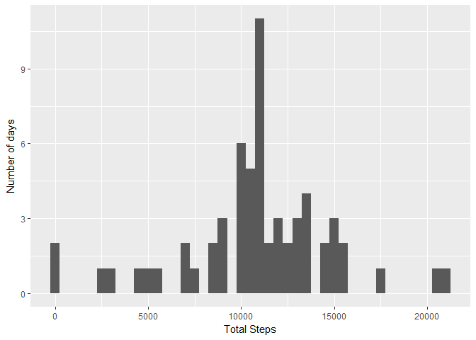

# Reproducible Research: Peer Assessment 1


```r
library(ggplot2)
```

```
## Warning: package 'ggplot2' was built under R version 3.4.2
```
##Loading and preprocessing the data


```r
activity <- read.csv("activity.csv")
```

##What is mean total number of steps taken per day?


```r
stepsday <- tapply(activity$steps,activity$date,sum,na.rm = TRUE)
```

####Make a histogram of the total number of steps taken each day

```r
qplot(stepsday,xlab= 'Total Steps',ylab= 'Number of days',binwidth = 500)
```

<!-- -->

####Calculate and report the mean and median total number of steps taken per day

```r
meanbyday <- mean(stepsday)
medianbyday <- median(stepsday)
```
* Mean:  9354.2295082

* Median:10395


##What is the average daily activity pattern?

####Make a time series plot

```r
stepsday <- aggregate(x=list(meansteps=activity$steps),by=list(interval = activity$interval),mean, na.rm=TRUE )
ggplot(data=stepsday, aes(interval,meansteps)) + geom_line() + xlab("5 minutes interval") + ylab("mean of steps")
```

<!-- -->

####Which 5-minute interval, on average across all the days in the dataset, contains the maximum number of steps?


```r
maxvalue<- stepsday[which.max(stepsday$meansteps),]
```

* Interval and max steps: 835, 206.1698113

#Imputing missing values

####Calculate and report the total number of missing values in the dataset


```r
missing <- length(which(is.na(activity$steps)))
```
 
 * Missing values: 2304
 
####Devise a strategy for filling in all of the missing values in the dataset.


```r
activityimp <- merge(activity,stepsday,by= "interval")
activityimp <- within(activityimp, steps<- ifelse(is.na(activityimp$steps),activityimp$meansteps,activityimp$steps))
```

####Create a new dataset that is equal to the original dataset but with the missing data filled in.


```r
totstepsday <- tapply(activityimp$steps,activityimp$date,sum,na.rm = TRUE)
```

####Make a histogram of the total number of steps taken each day


```r
qplot(totstepsday,xlab= 'Total Steps',ylab= 'Number of days',binwidth = 500)
```

<!-- -->

####Calculate and report the mean and median total number of steps taken per day


```r
totmeanbyday <- mean(totstepsday)
totmedianbyday <- median(totstepsday)
```

* Mean:  1.0766189\times 10^{4}
* Median:1.0766189\times 10^{4}

##Are there differences in activity patterns between weekdays and weekends?

####Create a new factor variable in the dataset with two levels - "weekday" and "weekend" indicating whether a given date is a weekday or weekend day.


```r
activityimp$dateType <-  ifelse(as.POSIXlt(activityimp$date)$wday %in% c(0,6), 'weekend', 'weekday')
```

####Make a panel plot containing a time series plot


```r
averagedActivityimp <- aggregate(steps ~ interval + dateType, data=activityimp, mean)
ggplot(averagedActivityimp, aes(interval, steps))+  
        geom_line() + 
        facet_grid(dateType ~ .)+ 
        xlab("5-minute interval")+  
        ylab("avarage number of steps")
```

<!-- -->
